# 🐧 Mini Rice GNOME - Exodia Inspired

Um rice minimalista e funcional para ambientes GNOME, inspirado no visual do Exodia OS. Este projeto personaliza o visual da interface com **Polybar** e **Rofi**, oferecendo uma experiência leve, bonita e eficiente.

---

## ✨ Features

- 🎯 Compatível com **GNOME**
- 🧩 **Barra personalizada com Polybar**
- 🎨 **9 temas diferentes**, com mudanças dinâmicas nas cores da barra
- 🌐 **Menu de internet** 
- ⚡ **Powermenu** 
- 📦 **Menu de aplicativos** com Rofi

---

## 🖥️ Requisitos

- GNOME instalado
- `polybar`, `rofi`
- Extensão para ocultar a barra padrão do GNOME
- https://extensions.gnome.org/extension/545/hide-top-bar/
---

## 🚀 Instalação

```bash

git clone https://github.com/Erick-IL/Exodia_rice.git
cd Exodia-rice

./install.sh

```

---


## 🧠 Atalhos

| Atalho           | Ação                        |
|------------------|-----------------------------|
| `Ctrl + Enter`   | Abrir GNOME Terminal        |
| `Super + Q`      | Abrir o Rofi (menu apps)    |
---

## 🧹 Desinstalação

```bash
./uninstall
```

---

## 📸 Screenshots

<details>
  
  <summary> Purple Eva 01 </summary>

  ### Desktop
  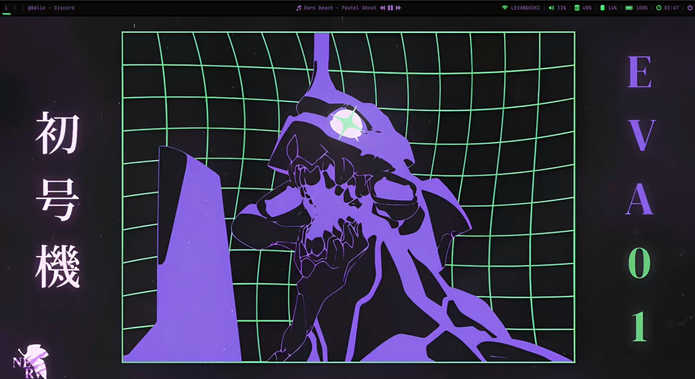
  ---
  ### Menu
  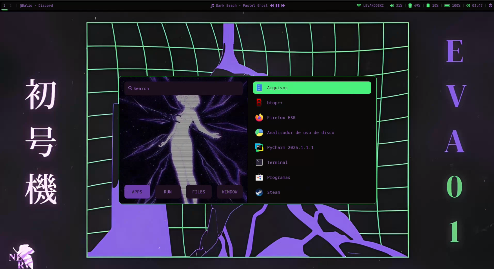
  ---
  ### PowerMenu
  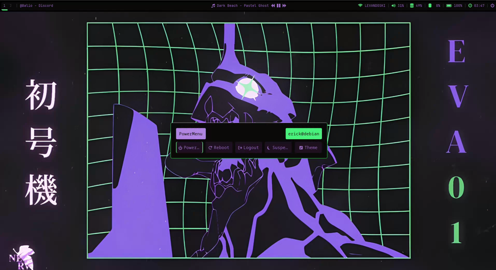


</details> 

<details>
  
  <summary> Red Cross Eva </summary>

  ### Desktop
  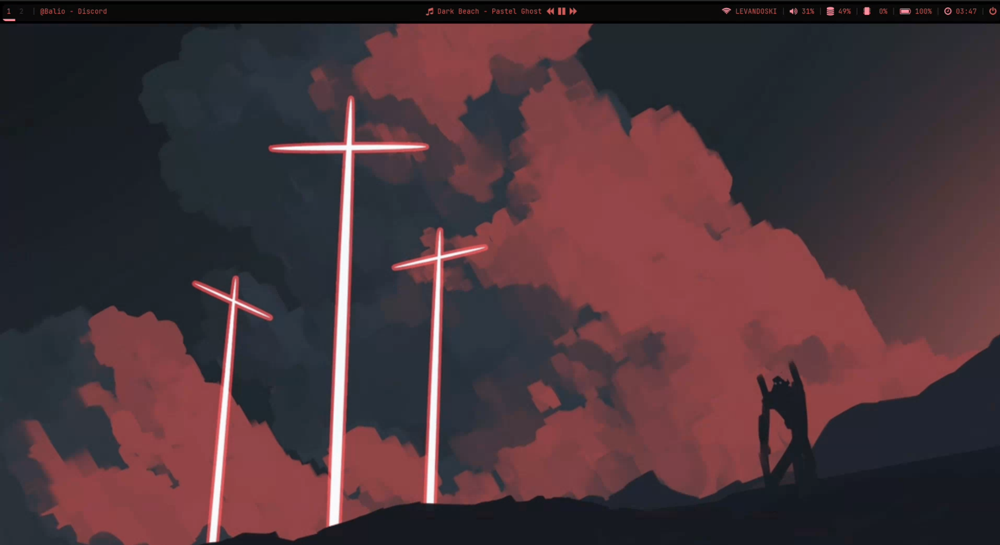
  ---
  ### Menu
  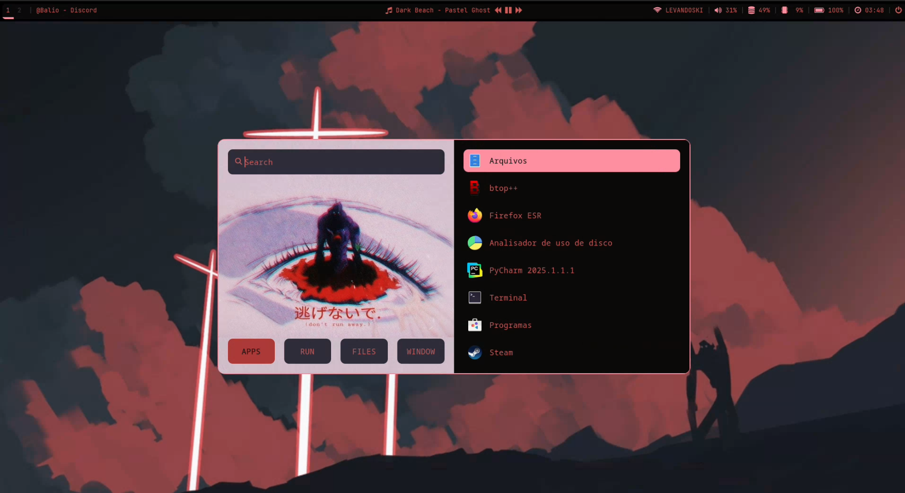
  ---
  ### PowerMenu
  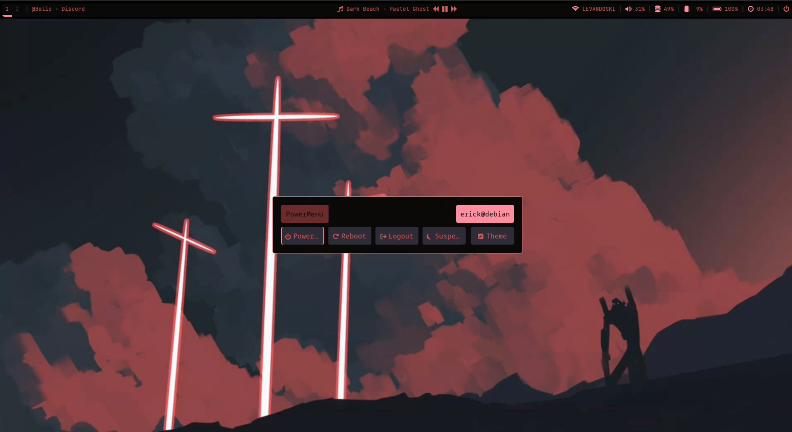
</details> 


<details>
  
  <summary> Musashi </summary>

  ### Desktop
  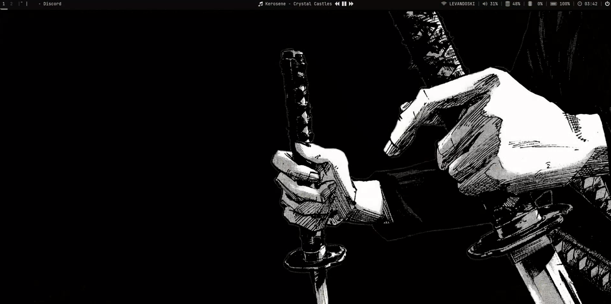
  ---
  ### Menu
  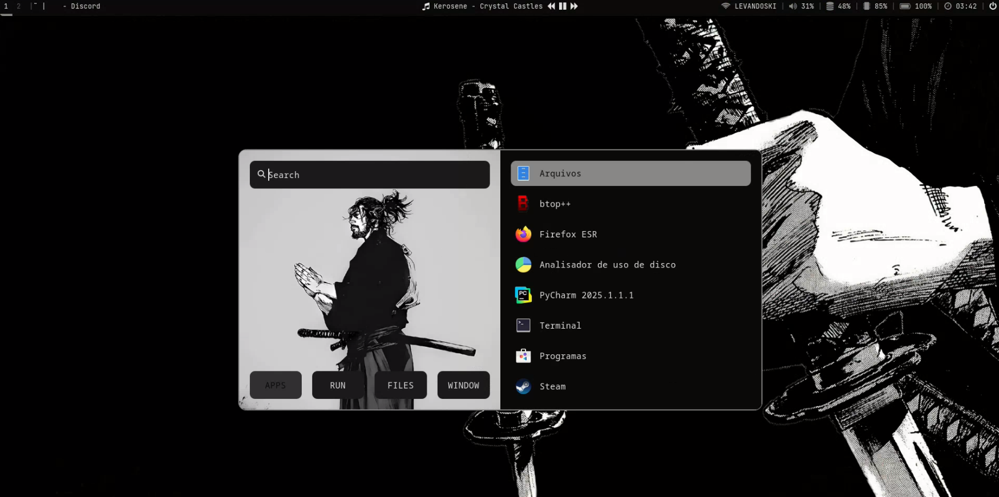
  ---
  ### PowerMenu
  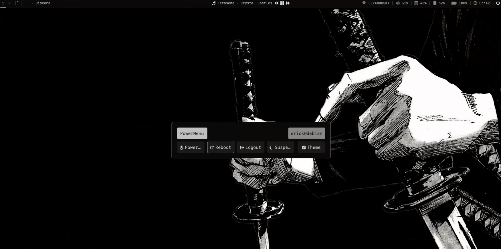
</details> 


<details>
  
  <summary> Guts </summary>

  ### Desktop
  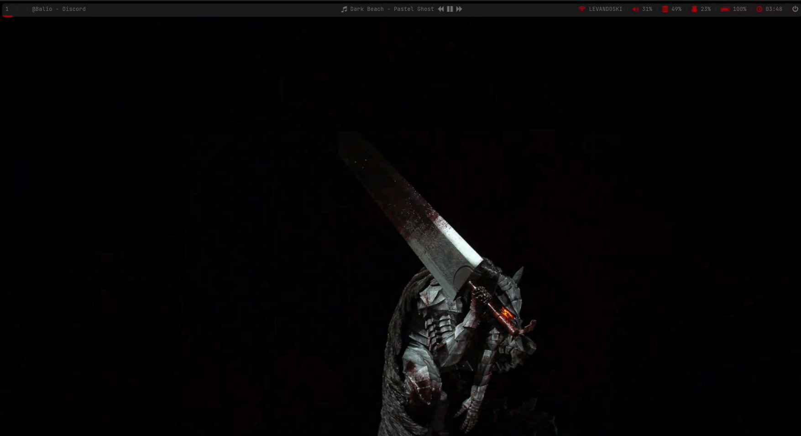
  ---
  ### Menu
  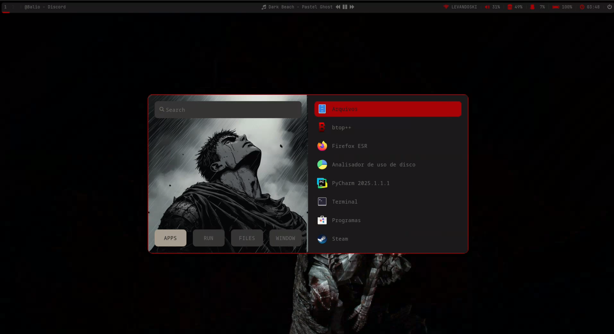
  ---
  ### PowerMenu
  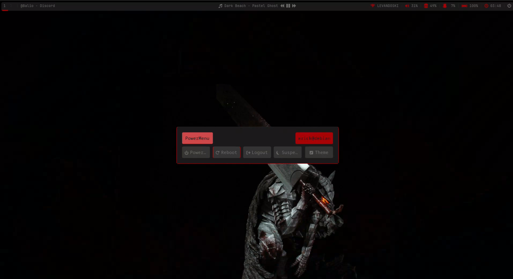
</details> 


<details>
  
  <summary> Black Magic </summary>

  ### Desktop
  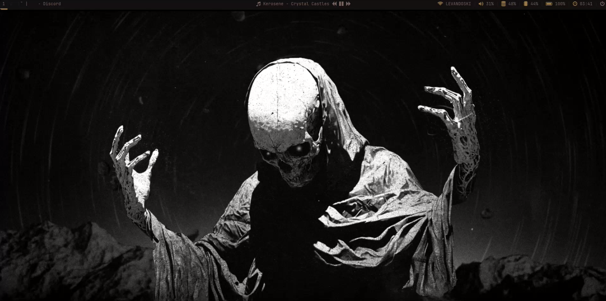
  ---
  ### Menu
  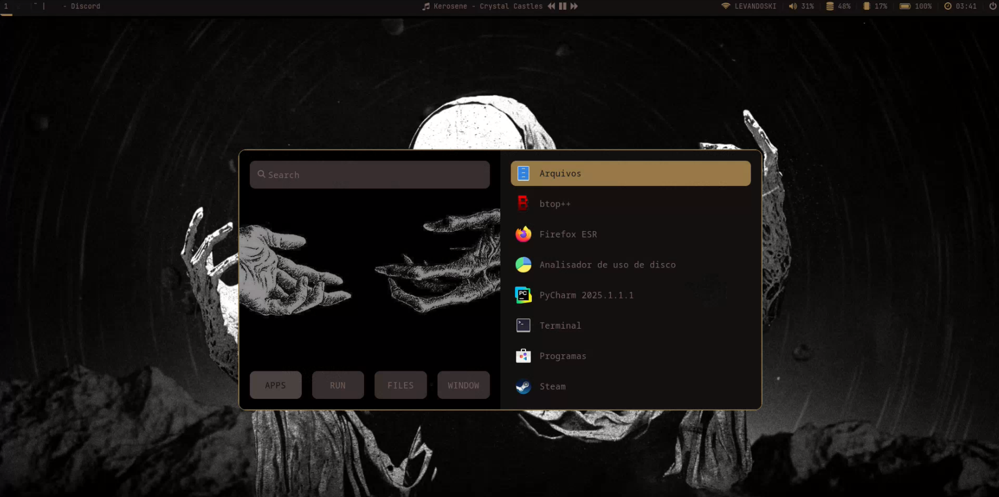
  ---
  ### PowerMenu
  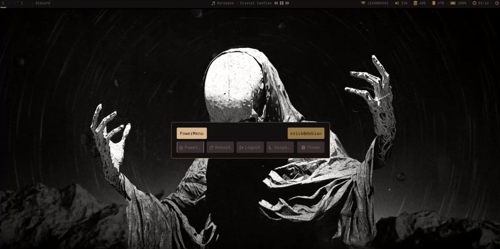
</details> 

---

